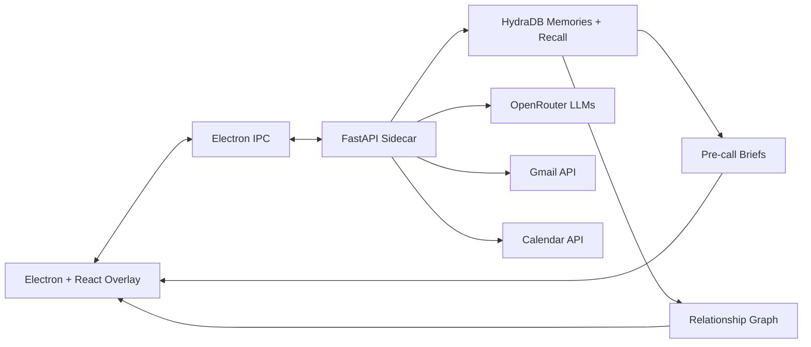

# Rapport

**Relationship intelligence for every professional conversation, powered by HydraDB.**

Rapport is a desktop companion that turns meetings, email threads, and calendar context into a living relationship memory. It sits as a minimal floating overlay, listens during calls, captures decision signals, and generates pre-call briefs that explain who matters, what changed, what risks are active, and what to say next.

The product is designed to show HydraDB at its best: long-lived memory, contextual recall, entity-rich relationship graphs, and sub-tenant isolation for per-contact intelligence.


## Why This Exists

Modern revenue, partnerships, investing, recruiting, and customer-success work depends on relationship context that is scattered across calls, inboxes, notes, and calendars. CRM fields capture what happened. Rapport captures what it means.

Rapport answers questions like:

- Is this person a champion, skeptic, neutral evaluator, or blocker?
- Who influences the actual decision?
- What concerns have repeated across multiple interactions?
- What changed since the last call?
- What should I avoid saying in the next meeting?
- What is the most useful next move?

## Why HydraDB

HydraDB is the core memory layer, not an interchangeable database.

Rapport uses HydraDB because the product needs:

- **Memories** for per-contact behavioral observations and preference signals.
- **Knowledge** for transcripts, emails, and account history.
- **Recall** across both personal memory and broader company context.
- **Sub-tenants** to isolate relationship intelligence by contact or workspace.
- **Context graph potential** for mapping influence, decision roles, concerns, and commitments.
- **Typed SDK integration** through the official Python SDK in the FastAPI sidecar.

This is exactly the kind of agentic application where HydraDB becomes more than storage: it becomes the continuity layer.

## Current Build

Implemented in this repository:

- Electron desktop shell
- React renderer with a Nothing OS-inspired floating UI
- FastAPI Python sidecar
- Official `hydradb-sdk` integration via `AsyncHydraDB`
- HydraDB memory writes for call/email interactions
- Parallel recall strategy using `recall_preferences` and `full_recall`
- OpenRouter hooks for extraction, transcription, and brief generation
- Gmail and Calendar extension points
- D3 relationship graph visualization
- Playwright smoke test for the renderer

## Architecture



## HydraDB Flow

1. Meeting transcript or email content is normalized into an interaction.
2. An LLM extracts relationship signals: stance, topics, commitments, decision roles, and risks.
3. Rapport writes a memory through `AsyncHydraDB.upload.add_memory`.
4. Before a meeting, Rapport recalls both:
   - `recall_preferences` for per-contact behavioral memory
   - `full_recall` for wider account knowledge
5. The brief generator converts recalled context into a tactical pre-call brief.

See [docs/HYDRADB_INTEGRATION.md](docs/HYDRADB_INTEGRATION.md) for the deeper integration notes.

## Quick Start

```powershell
npm install
python -m pip install -r python-sidecar/requirements.txt
npm run dev
```

For sidecar-only development:

```powershell
npm run sidecar
npm exec vite -- src/renderer --host 127.0.0.1 --port 5173
```

## Environment

Copy `.env.example` to `.env` and set:

```env
HYDRA_DB_API_KEY=...
HYDRA_DB_TENANT_ID=mq66nfnt5t
HYDRADB_TENANT_ID=mq66nfnt5t
OPENROUTER_API_KEY=...
MY_EMAIL=you@example.com
```

## Verification

```powershell
npm run build
node scripts\smoke-renderer.mjs
```

Verified locally:

- TypeScript/Electron production build passes
- Python sidecar imports compile
- Renderer smoke test passes
- `renderer-smoke.png` is generated for visual review

## Documentation

- [Product Pitch](docs/PITCH.md)
- [HydraDB Integration](docs/HYDRADB_INTEGRATION.md)
- [Architecture](docs/ARCHITECTURE.md)
- [Demo Script](docs/DEMO_SCRIPT.md)
- [Setup Guide](docs/SETUP.md)

## Pitch Summary

Rapport is a showcase for HydraDB-powered product memory. It demonstrates how a desktop AI application can move beyond ephemeral chat and build durable, structured, relationship-aware context over time.

The short version: **HydraDB remembers the relationship. Rapport helps you act on it.**
