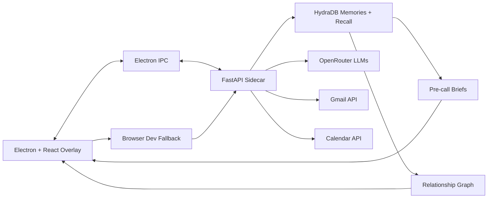

# Rapport

**AI relationship memory for every important conversation, powered by HydraDB.**

Rapport is a desktop relationship-intelligence overlay that turns emails, calls, and meeting context into durable memory. It retrieves real contacts from HydraDB, visualizes relationship context, supports live call capture, and generates tactical pre-call briefs so users can walk into conversations with context instead of guesswork.


## Tagline

AI relationship memory that turns emails and calls into live context for better conversations.

## What It Does

Relationship context is usually scattered across inboxes, meeting notes, CRM fields, and memory. Rapport brings that context into a compact desktop companion:

- Loads real contacts from HydraDB memory.
- Shows each contact's stance, company, email, topics, and last interaction.
- Visualizes the relationship network with a D3 graph.
- Ingests email context and writes extracted relationship signals into HydraDB.
- Starts live capture for calls and stores important conversation signals.
- Generates pre-call briefs with talking points, concerns, landmines, and next steps.
- Falls back gracefully to local/demo contacts when HydraDB is not configured, so the app remains demoable.

## Why HydraDB

HydraDB is the core memory layer for Rapport. The app uses it to store relationship observations and recall them later across sessions.

Rapport uses HydraDB for:

- Per-contact memory through sub-tenant isolation.
- Durable interaction history from email and call capture.
- Contextual recall through `recall_preferences` and `full_recall`.
- Relationship graph discovery from stored memory sources.
- A practical long-context workflow where memory changes the UI, not just a chat response.

The short version: **HydraDB remembers the relationship. Rapport helps you act on it.**

## Architecture



## Built With

- Electron
- React
- TypeScript
- Vite
- Python
- FastAPI
- HydraDB
- D3
- OpenRouter
- Gmail API extension points

## Quick Start

Install dependencies:

```powershell
npm install
python -m pip install -r python-sidecar/requirements.txt
```

Create `.env` from `.env.example` and set your keys:

```env
HYDRA_DB_API_KEY=...
HYDRA_DB_TENANT_ID=...
HYDRADB_TENANT_ID=...
OPENROUTER_API_KEY=...
MY_EMAIL=you@example.com
```

Run the desktop app:

```powershell
npm run dev
```

If port `5173` is busy, Electron Vite will choose another renderer port automatically.

Run only the Python sidecar:

```powershell
npm run sidecar
```

Check the contacts endpoint:

```powershell
Invoke-RestMethod http://127.0.0.1:8765/contacts | ConvertTo-Json -Depth 5
```

## Verification

```powershell
npm run build
```

Optional renderer smoke test, once the Vite renderer is running:

```powershell
node scripts\smoke-renderer.mjs
```

## Demo Flow

For a hackathon demo:

1. Start the app with `npm run dev`.
2. Show the status pill and `Source: hydradb`.
3. Click through real contact chips.
4. Show the selected contact card and stance.
5. Show the relationship graph.
6. Click `Ingest` to demonstrate the memory write path.
7. Click `Start`, then `End`, to show live capture.
8. Click `Memory`, type `brief`, and run the pre-call brief workflow.

See [docs/DEMO_SCRIPT.md](docs/DEMO_SCRIPT.md) for the full voiceover script.

## Project Structure

```text
src/main/              Electron main process and sidecar orchestration
src/preload/           Secure Electron IPC bridge
src/renderer/          React UI and relationship graph
python-sidecar/        FastAPI app, HydraDB integration, ingestion, recall
docs/                  Pitch, architecture, setup, and integration notes
scripts/               Renderer smoke test
```

## Documentation

- [Demo Script](docs/DEMO_SCRIPT.md)
- [Product Pitch](docs/PITCH.md)
- [HydraDB Integration](docs/HYDRADB_INTEGRATION.md)
- [Architecture](docs/ARCHITECTURE.md)
- [Setup Guide](docs/SETUP.md)

## Submission Summary

Rapport is an AI-powered relationship memory overlay. It uses HydraDB to store and recall context from emails and conversations, then surfaces contacts, relationship graphs, and pre-call briefs in a live desktop UI.
