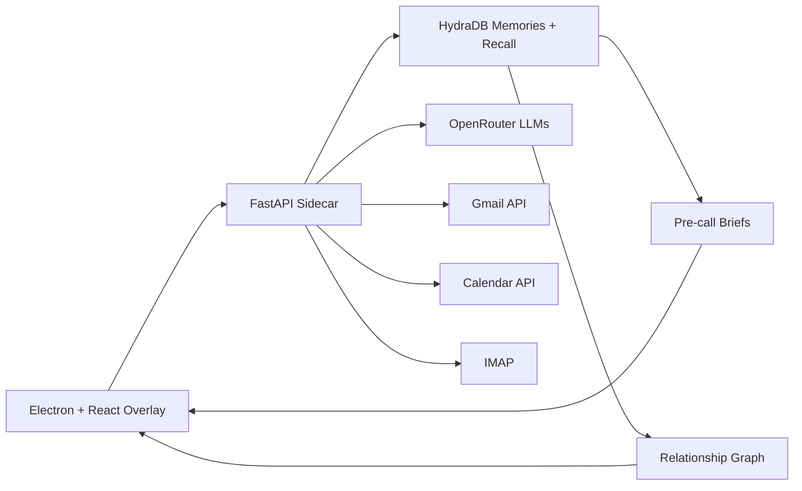

# Rapport

**AI relationship memory for every important conversation, powered by HydraDB.**

Rapport is a desktop relationship-intelligence overlay that turns emails, calls, and meeting context into durable memory. It retrieves real contacts from HydraDB, visualizes relationship context, supports live call capture, and generates tactical pre-call briefs so users can walk into conversations with context instead of guesswork.


## Tagline

AI relationship memory that turns emails and calls into live context for better conversations.

## What It Does

Relationship context is usually scattered across inboxes, meeting notes, and memory. Rapport brings that context into a compact desktop companion:

- Loads real contacts from HydraDB memory.
- Shows each contact's stance, company, email, topics, and last interaction.
- Visualizes the relationship network with a D3 graph.
- Ingests email context and writes extracted relationship signals into HydraDB.
- Starts live capture for calls and stores important conversation signals.
- Generates pre-call briefs with talking points, concerns, landmines, and next steps.
- Syncs emails via Gmail OAuth, IMAP, or drag-and-drop .eml/.mbox import.
- Polls Google Calendar for upcoming meetings and auto-generates briefs.
- Encrypts stored IMAP credentials at rest using Fernet symmetric encryption.
- Provides data retention controls to delete local contacts, credentials, and all data.
- Surfaces LLM extraction and brief generation errors to the user in real time.
- Rate-limits all API endpoints to prevent abuse.

## Why HydraDB

HydraDB is the core memory layer for Rapport. The app uses it to store relationship observations and recall them later across sessions.

Rapport uses HydraDB for:

- Per-contact memory through sub-tenant isolation.
- Durable interaction history from email and call capture.
- Contextual recall through `recall_preferences` and `full_recall`.
- Relationship graph discovery from stored memory sources.
- A practical long-context workflow where memory changes the UI, not just a chat response.

The short version: **HydraDB remembers the relationship. Rapport helps you act on it.**

## Architecture



## Built With

- Electron
- React
- TypeScript
- Vite
- Python
- FastAPI
- HydraDB
- D3
- OpenRouter
- Gmail API
- Calendar API
- IMAP
- cryptography (Fernet encryption for IMAP credentials)
- slowapi (API rate limiting)

## Quick Start

Install dependencies:

```powershell
npm install
python -m pip install -r python-sidecar/requirements.txt
```

Create `.env` from `.env.example` and set your keys:

```env
HYDRA_DB_API_KEY=...
HYDRA_DB_TENANT_ID=...
OPENROUTER_API_KEY=...
MY_EMAIL=you@example.com
```

Run the desktop app:

```powershell
npm run dev
```

If port `5173` is busy, Electron Vite will choose another renderer port automatically.

Run only the Python sidecar:

```powershell
npm run sidecar
```

Check the contacts endpoint:

```powershell
Invoke-RestMethod http://127.0.0.1:8765/contacts | ConvertTo-Json -Depth 5
```

## Verification

```powershell
npm run build
```

Optional renderer smoke test, once the Vite renderer is running:

```powershell
node scripts/smoke-renderer.mjs
```

## Project Structure

```text
src/main/              Electron main process and sidecar orchestration
src/preload/           Secure Electron IPC bridge
src/renderer/          React UI and relationship graph
python-sidecar/        FastAPI app, HydraDB integration, ingestion, recall
python-sidecar/imap_secret_store.py   Encrypted IMAP credential storage
resources/             Tray icon and app assets
docs/                  Pitch, architecture, setup, and integration notes
scripts/               Renderer smoke test
PRIVACY_POLICY.md      Privacy policy and open-source disclaimer
```

## API Endpoints

| Method | Path | Description |
|---|---|---|
| GET | `/health` | Health check |
| GET | `/status` | Dependency status (HydraDB, OpenRouter, Mic, IMAP) |
| GET | `/contacts` | List contacts from HydraDB + local cache |
| GET | `/graph` | Relationship graph data |
| GET | `/brief/{email}` | Generate pre-call brief for a contact |
| POST | `/configure` | Save API keys to `.env` |
| POST | `/recording/start` | Start live audio capture |
| POST | `/recording/stop` | Stop live audio capture |
| POST | `/ingest/file` | Upload .eml/.mbox files |
| POST | `/ingest/emails` | Trigger Gmail ingestion |
| POST | `/ingest/imap` | Trigger IMAP sync (saves credentials) |
| GET | `/imap/credentials` | List stored IMAP hosts |
| POST | `/imap/credentials/use` | Re-use stored IMAP credentials |
| DELETE | `/imap/credentials` | Delete stored IMAP credentials |
| DELETE | `/data/transcripts` | Clear transcript buffer |
| DELETE | `/data/contacts` | Delete local contacts |
| DELETE | `/data/all` | Delete all local data |
| WS | `/ws/transcript` | WebSocket for live transcript, briefs, errors |

## Documentation

- [Product Pitch](docs/PITCH.md)
- [HydraDB Integration](docs/HYDRADB_INTEGRATION.md)
- [Architecture](docs/ARCHITECTURE.md)
- [Setup Guide](docs/SETUP.md)
- [Privacy Policy](PRIVACY_POLICY.md)

## Privacy & Security

- IMAP credentials are encrypted at rest using Fernet symmetric encryption.
- All API endpoints are rate-limited.
- LLM failures are surfaced to users, not silently swallowed.
- Data retention controls let users delete local data from the Settings panel.
- See [PRIVACY_POLICY.md](PRIVACY_POLICY.md) for the full privacy policy and open-source disclaimer.

## Submission Summary

Rapport is an AI-powered relationship memory overlay. It uses HydraDB to store and recall context from emails and conversations, then surfaces contacts, relationship graphs, and pre-call briefs in a live desktop UI.
