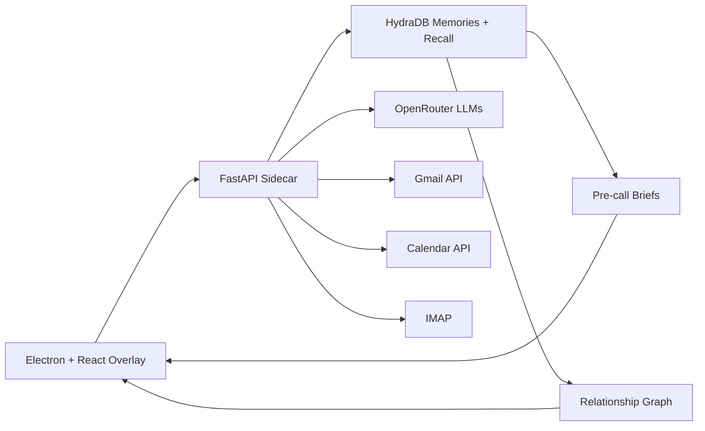

<h1 align="center">Rapport</h1>

<p align="center">
  <strong>AI relationship memory for every important conversation.</strong>
</p>

<p align="center">
  <a href="LICENSE"></a>
  <a href="#"></a>
  
</p>

<br />


<!-- TODO: Add a 30-second GIF demo showing the core loop: contact list → brief generation → live call capture -->

---

## What It Does

Relationship context is scattered across inboxes, meeting notes, and memory. Rapport brings it into a compact desktop companion so you walk into every conversation prepared.

- **Pre-call briefs** — Tactical talking points, concerns, landmines, and communication style from past interactions
- **Live call capture** — Records and transcribes calls in real time, extracting stance shifts and commitments
- **Email ingestion** — Processes Gmail, IMAP, or `.eml`/`.mbox` files for relationship signals
- **Relationship graph** — Visualizes your network with person nodes and evidence-based edges (influencers, blockers, decision chains)
- **Calendar polling** — Detects upcoming meetings and auto-generates briefs for attendees

Rapport uses [HydraDB](https://hydradb.ai) as its memory layer — storing behavioral observations from every interaction and recalling them when you need context. Sub-tenant isolation keeps each contact's memory separate while full recall brings company-wide knowledge into every brief.

## Quick Start

Install dependencies:

```bash
npm install
pip install -r python-sidecar/requirements.txt
```

Copy `.env.example` to `.env` and set your keys:

```env
HYDRA_DB_API_KEY=...
HYDRA_DB_TENANT_ID=...
OPENROUTER_API_KEY=...
MY_EMAIL=you@example.com
```

Run the desktop app:

```bash
npm run dev
```

Run only the Python sidecar:

```bash
npm run sidecar
```

Verify everything works:

```bash
npm run build
curl http://127.0.0.1:8765/health
```

## Architecture



The Electron main process spawns the Python sidecar on launch. The React renderer communicates through a secure preload bridge — it never talks to HydraDB or external APIs directly. Secrets stay in environment variables, never exposed to the frontend.

For a deeper walkthrough, see [docs/ARCHITECTURE.md](docs/ARCHITECTURE.md).

## Built With

| Layer | Stack |
|---|---|
| Desktop shell | Electron 33 |
| UI | React 19, TypeScript, Vite, D3, Framer Motion |
| State | Zustand |
| Intelligence sidecar | Python 3.10+, FastAPI, Uvicorn |
| Memory | HydraDB |
| AI / LLM | OpenRouter (extraction + transcription + briefs) |
| Ingestion | Gmail API, IMAP, Google Calendar |
| Security | Fernet encryption (IMAP credentials), slowapi (rate limiting) |

## Documentation

- [Architecture](docs/ARCHITECTURE.md)
- [API Reference](docs/API.md)
- [Setup Guide](docs/SETUP.md)
- [HydraDB Integration](docs/HYDRADB_INTEGRATION.md)
- [Privacy Policy](PRIVACY_POLICY.md)

## Contributing

Contributions are welcome. Rapport is Apache 2.0 licensed and open to improvements of any size — bug fixes, features, docs, or design.

Read [CONTRIBUTING.md](CONTRIBUTING.md) for the development workflow and submission guidelines.

## Privacy & Security

- IMAP credentials are encrypted at rest using Fernet symmetric encryption
- API keys live in environment variables only — never exposed to the frontend
- Rate limiting on key endpoints prevents abuse
- LLM failures are surfaced to users, not silently swallowed
- Data retention controls let you delete local contacts, credentials, and all data
- Recording consent is your responsibility — Rapport does not auto-notify participants

See [PRIVACY_POLICY.md](PRIVACY_POLICY.md) for the full privacy policy and open-source disclaimer.

## License

This project is licensed under the Apache License 2.0. See [LICENSE](LICENSE) for the full text.

---

<p align="center">
  Built with <a href="https://hydradb.ai">HydraDB</a>
</p>
