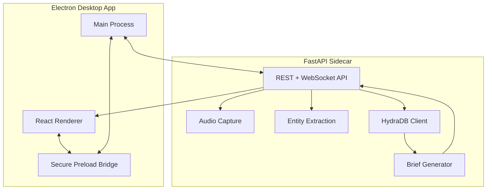
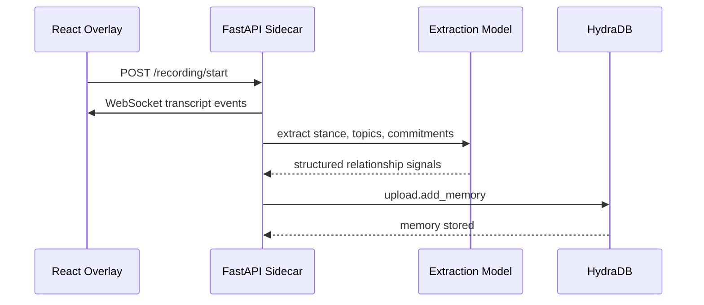
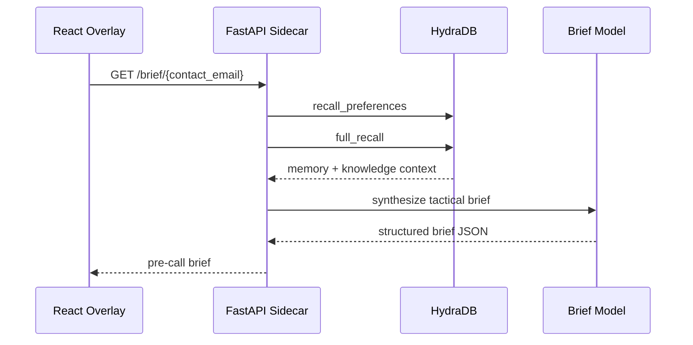

# Architecture

## Overview

Rapport is a local-first desktop app with a Python intelligence sidecar.



## Components

### Electron Main

Location:

```text
src/main/index.ts
```

Responsibilities:

- creates the floating desktop window
- spawns the Python sidecar
- exposes IPC handlers
- owns tray actions
- keeps secrets out of the renderer

### React Renderer

Location:

```text
src/renderer/src
```

Responsibilities:

- floating orb UI
- live capture strip
- pre-call brief panel
- command bar
- relationship graph
- local UI state

### FastAPI Sidecar

Location:

```text
python-sidecar
```

Responsibilities:

- transcript processing
- LLM extraction
- HydraDB writes and recall
- Gmail ingestion
- Calendar polling
- WebSocket push to the overlay

## Data Flow

### Call Capture



### Pre-Call Brief



## Design Principles

- The renderer never talks to HydraDB directly.
- The sidecar owns every external API call.
- HydraDB stores durable relationship memory.
- The app remains runnable with fallback data when keys are absent.
- The UI is compact because the product is meant to live beside meetings, not replace them.

## Security Posture

- API keys live in environment variables or `.env`.
- Secrets are not exposed through the preload bridge.
- Gmail tokens should be stored outside the app bundle.
- Recording state is visible in the UI.
- Future production builds should add explicit meeting opt-in and local transcript retention controls.
